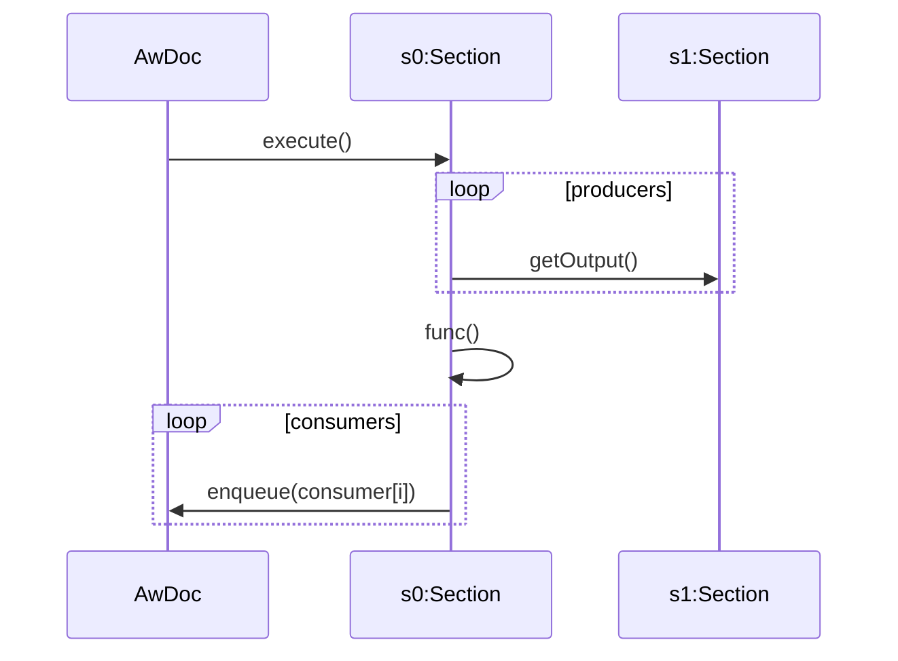

Section Execution
=================

Initial Document Execution
--------------------------

In the initial document execution runnable sections are executed sequentially in the order they are presented in the document. During inital document execution sections can call the enqueque() method, however, no action is taken.

Event Triggered Execution
-------------------------

Many sections in a document will be editable to facilitate user interaction. Editable sections will have a **Run** button or similar to trigger execution of sections that are dependant on the data provided. When a section is executed it gets its input from a list of producers and not just the section that triggered the execution.

Section Types
-------------

### Basic

The simplest of documents will have just *Basic* sections. These are executed sequentially when the document is first executed but are not event driven.

### Callable

*Callable* sections are not directly executed by either the initial document execution nor are they event driven. These are *called* by other sections.

### Consumer

*Consumer* sections request their input data from a number of specified producer sections.

### Input

User input can be provided througt the use of *input* sections. Examples can be plain text, HTML forms, etc. These will typically have a 'Run' or 'Submit' button to signal to the document that the user has provided data. Further processing is often required on the data provided by the user. Input sections have a list of consumers that are queued for execution when data is submitted.

### Parser

Parses user supplied data from a list of input sections and has a list of consumers (or additional parsers) that are queued for execution after the data is parsed.

| Section type  | Has user defined ID | Has producers | Has consumers | Has Wrapper |
| ------------- | ------------------- | ------------- | ------------- | ------------|
| Basic         | False               | False         | False         | True        |
| Callable      | True                | False         | False         | True        |
| Consumer      | False               | True          | False         | True        |
| Input         | True                | False         | True          | False       |
| Parser        | True                | True          | True          | True        |

Use **callable** attribute, defaults as above, according to user defined ID.