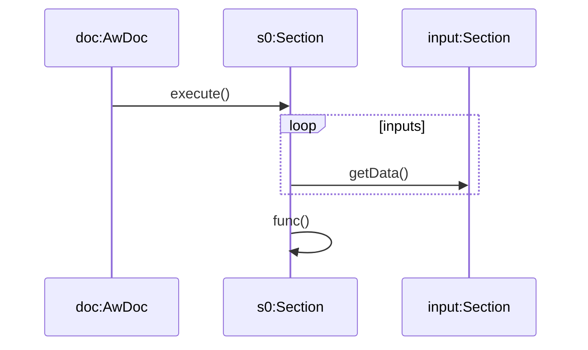
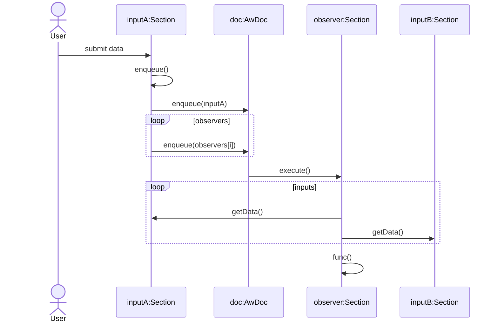

Section Execution
=================

Initial Document Execution
--------------------------

In the initial document execution all sections that have their **initial** attribute set are executed sequentially in the order they are presented in the document.

Event Triggered Execution
-------------------------

Many sections in a document will be editable to facilitate user interaction. Editable sections will have a **Run** button or similar to trigger execution of  *observer* sections that are dependant on the data provided. When a section is executed it gets its input from a list of producers and not just the section that triggered the execution.

Section Types
-------------

### Basic

The simplest of documents will have just *Basic* sections. These are executed sequentially when the document is first executed but are not event driven.

### Callable

*Callable* sections are not directly executed by either the initial document execution nor are they event driven. These are *called* by other sections. These have no input or observer sections and must have a user defined ID. When these condiotns are met, the **initial** attribute is cleared to prevent execution during the initial document execution.

### Input

User input can be provided througt the use of *input* sections. Examples can be plain text, HTML forms, etc. These will typically have a 'Run' or 'Submit' button to signal to the document that the user has provided data. Further processing is often required on the data provided by the user. Input sections have a list of observers that are queued for execution when data is submitted.

### Observer

An observer processes user supplied data from a list of input sections.

| Section type | Has user defined ID | Has inputs | Has observers | Has Wrapper |
| ------------ | ------------------- | ---------- | ------------- | ------------|
| Basic        | False               | False      | False         | True        |
| Callable     | True                | False      | False         | True        |
| Observer     | Optional            | True       | Optional      | True        |
| Input        | True                | False      | True          | False       |

Use **initial** attribute, defaults as above, according to user defined ID.