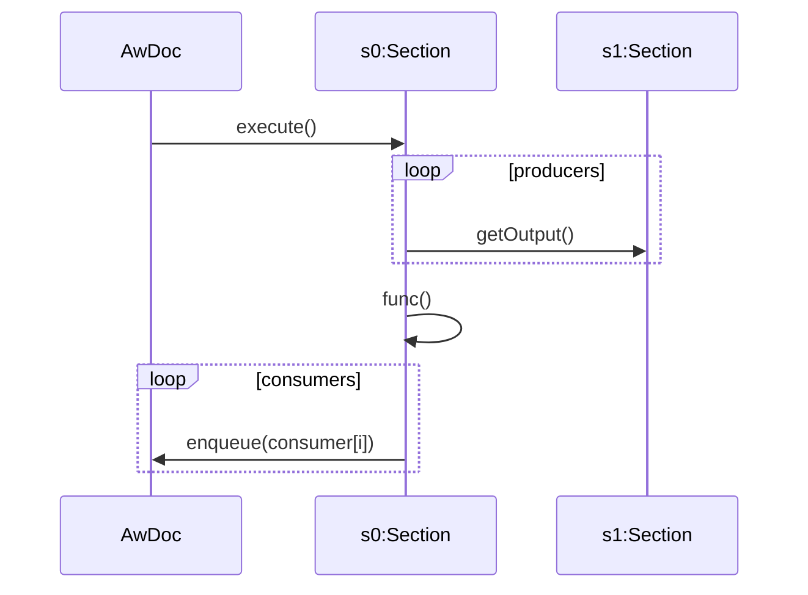

Section Execution
=================

Initial Document Execution
--------------------------

In the initial document execution runnable sections are executed sequentially in the order they are presented in the document.

Event Triggered Execution
-------------------------

To Do!

